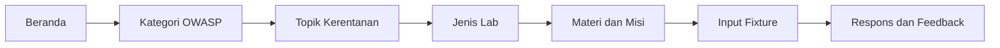

<div align="center">

# 🛡️ SITP Academy

### OWASP Top 10:2025 · Hands-on Web Security Learning Lab


> **Portal belajar keamanan web berbasis praktik** untuk memahami pola kerentanan OWASP, mencoba input pada fixture terisolasi, membaca hint bertahap, dan melihat dampaknya melalui visualisasi respons.

🌐 Demo / GitHub Pages: **https://cakgup.github.io/sitp_academy/**  
📦 Repository: **https://github.com/cakgup/sitp_academy**

</div>

---

## 📌 Ringkasan

**SITP Academy** adalah portal latihan keamanan aplikasi web yang mengelompokkan materi ke dalam **10 kategori OWASP Top 10:2025**, **33 topik**, **144 materi**, dan **154 lab**. Setiap materi mengarah ke skenario latihan yang memiliki misi, langkah awal, hint bertahap, contoh input, evaluator, dan penjelasan mitigasi.

Aplikasi berjalan sebagai **static site** menggunakan HTML, CSS, dan JavaScript. Tidak ada backend, database, package manager, atau proses build yang dibutuhkan untuk menggunakan portal. Katalog, fixture, evaluator, hint, dan progres belajar dimuat dari aset repository dan disimpan lokal pada browser.

Versi ini cocok untuk:

- pembelajaran mandiri keamanan aplikasi web;
- demo kelas atau workshop internal;
- latihan mengenali pola input dan dampak kerentanan;
- pengantar OWASP Top 10 dengan umpan balik langsung;
- fork dan kustomisasi portal latihan untuk lingkungan pendidikan.

---

## Daftar Isi

- [Fitur Utama](#fitur-utama)
- [Katalog dan Alur Belajar](#katalog-dan-alur-belajar)
- [Jenis Lab](#jenis-lab)
- [Cara Menggunakan](#cara-menggunakan)
- [Penyimpanan Progres](#penyimpanan-progres)
- [Menjalankan Secara Lokal](#menjalankan-secara-lokal)
- [Publikasi ke GitHub Pages](#publikasi-ke-github-pages)
- [Struktur Repository](#struktur-repository)
- [Validasi](#validasi)
- [Kustomisasi](#kustomisasi)
- [Batasan dan Keamanan](#batasan-dan-keamanan)
- [Kontribusi](#kontribusi)
- [Lisensi](#lisensi)

---

## ✨ Fitur Utama

| Fitur | Keterangan |
|---|---|
| 🗂️ **Katalog bertingkat** | Beranda → kategori OWASP → topik → jenis lab → halaman lab. |
| 🧪 **154 lab interaktif** | Setiap lab memiliki input, contoh jawaban, evaluator, hint, dan respons fixture. |
| 🧭 **Hint bertahap** | Tiga tingkat hint membantu peserta memahami konsep tanpa langsung membuka jawaban. |
| 📊 **Live fixture runner** | Respons divisualisasikan sebagai tabel, preview payload, atau data field/value sesuai skenario. |
| 🔎 **Pencarian materi** | Cari kategori, topik, judul materi, atau lab dari satu halaman. |
| 📚 **Pustaka materi** | Materi dapat dibaca kembali tanpa kehilangan konteks lab. |
| ✅ **Progres lokal** | Lab selesai, materi dibaca, nama panggilan, dan XP tersimpan di browser. |
| 🔗 **Hash routing** | Navigasi tetap bekerja pada alamat project GitHub Pages tanpa konfigurasi server. |
| 📱 **Responsive UI** | Kartu, form, tabel, dan panel lab menyesuaikan desktop, tablet, dan ponsel. |
| 🎨 **Tema SITP biru** | Design token, kartu, badge, dan fixture runner memakai satu sistem visual yang konsisten. |

---

## 🗂️ Katalog dan Alur Belajar

Kategori yang tersedia:

| Kode | Kategori |
|---|---|
| **A01:2025** | Broken Access Control |
| **A02:2025** | Security Misconfiguration |
| **A03:2025** | Software Supply Chain Failures |
| **A04:2025** | Cryptographic Failures |
| **A05:2025** | Injection |
| **A06:2025** | Insecure Design |
| **A07:2025** | Authentication Failures |
| **A08:2025** | Software or Data Integrity Failures |
| **A09:2025** | Logging & Alerting Failures |
| **A10:2025** | Mishandling of Exceptional Conditions |

Setiap kategori berisi topik, misalnya IDOR, XSS, SQL Injection, OS Command Injection, LFI, dan File Upload. Setiap topik berisi jenis latihan yang lebih spesifik sebelum peserta masuk ke lab.



Rute hash utama:

| Rute | Fungsi |
|---|---|
| `#/` | Beranda dan ringkasan katalog |
| `#/category/<category-id>` | Daftar topik dalam kategori |
| `#/topic/<category-id>/<topic-id>` | Daftar jenis lab dalam topik |
| `#/material/<lesson-id>` | Materi referensi dan konteks latihan |
| `#/lab/<lab-id>` | Halaman misi, input, hint, dan fixture runner |
| `#/all-labs` | Daftar seluruh lab |
| `#/library` | Pustaka materi |
| `#/progress` | Progres, XP, dan profil lokal |

---

## 🧪 Jenis Lab

Lab menggunakan pola input yang berbeda sesuai konsep yang dipelajari:

- **IDOR dan broken access control** — ubah identifier objek atau jalur fungsi untuk membuktikan pemeriksaan kepemilikan yang hilang.
- **Injection** — uji input SQL, XSS, command, atau template pada fixture yang mengembalikan respons terstruktur.
- **LFI dan file upload** — amati validasi path, ekstensi, content type, dan nama file melalui model respons.
- **Authentication dan session** — periksa alur login, role, reset password, atau cookie pada data fiktif.
- **Cryptography** — kenali hash lemah, secret yang bocor, encoding yang disalahartikan sebagai enkripsi, dan random yang tidak aman.
- **Security misconfiguration** — temukan header, debug mode, metode HTTP, file konfigurasi, atau default setting yang terbuka.
- **Supply chain dan integrity** — evaluasi SRI, lockfile, package, update, dan verifikasi sumber data.
- **Logging, exception, dan desain** — identifikasi respons error, alert, rate limit, serta aturan bisnis yang tidak lengkap.

Untuk skenario yang mengembalikan objek data, fixture runner menampilkan tabel **Field / Nilai**. Respons IDOR menampilkan tabel **Status / Invoice / Owner / Session user**. Lab XSS pada deployment publik menampilkan **Payload preview** yang sudah di-escape.

---

## 🚀 Cara Menggunakan

1. Buka [SITP Academy](https://cakgup.github.io/sitp_academy/).
2. Pilih kategori OWASP dari beranda.
3. Pilih topik dan jenis lab yang ingin dipelajari.
4. Baca misi, target, dan langkah awal pada panel kiri.
5. Jalankan input awal untuk melihat respons pembanding.
6. Ubah input sesuai hint, lalu klik **Jalankan**.
7. Bandingkan respons fixture dengan target dan baca penjelasan setelah berhasil.
8. Gunakan **Ulang dari awal** untuk mengembalikan fixture ke keadaan awal.

Jawaban yang salah tidak mengurangi XP. Hint dapat dibuka bertahap dan tidak menghapus progres yang sudah selesai.

---

## 💾 Penyimpanan Progres

Data berikut disimpan di `localStorage` pada browser:

- lab yang sudah selesai;
- materi yang sudah dibaca;
- nama panggilan dan XP;
- bookmark atau status belajar yang tersedia pada UI.

Progres terpisah berdasarkan browser, profil, dan alamat. GitHub Pages tidak menyimpan progres ke server dan tidak menyinkronkan progres antar perangkat. Menghapus data situs atau menggunakan mode privat dapat menghapus progres lokal.

---

## 🛠️ Menjalankan Secara Lokal

Clone repository lalu jalankan server file statis dari root proyek:

```bash
git clone https://github.com/cakgup/sitp_academy.git
cd sitp_academy
python -m http.server 8080
```

Buka [http://localhost:8080/](http://localhost:8080/).

Server lokal disarankan karena browser dapat membatasi `fetch()` JSON saat halaman dibuka melalui `file://`. Tidak diperlukan PHP, SQLite, Node.js, npm, Docker, atau package manager untuk menggunakan versi statis ini.

---

## 🌐 Publikasi ke GitHub Pages

Repository ini sudah menggunakan workflow [`.github/workflows/pages.yml`](.github/workflows/pages.yml) dan dapat dipublikasikan melalui GitHub Actions.

1. Fork repository atau push isi proyek ke repository GitHub Anda.
2. Buka **Settings → Pages**.
3. Pada **Build and deployment**, pilih **GitHub Actions**.
4. Push ke branch `main` atau jalankan workflow **Deploy static site to GitHub Pages** secara manual.
5. Setelah workflow selesai, buka URL Pages yang ditampilkan GitHub.

Untuk repository ini, alamat publiknya adalah:

```text
https://cakgup.github.io/sitp_academy/
```

Workflow mengunggah seluruh root repository sebagai artifact. File `.nojekyll` menjaga aset statis tetap dilayani apa adanya.

---

## 🏗️ Struktur Repository

```text
sitp_academy/
├── index.html                 # Shell aplikasi dan metadata GitHub Pages
├── assets/
│   ├── app.js                 # Routing, katalog, evaluator, fixture, dan progres
│   ├── app.css                # Design token, kartu, layout, tabel, dan responsivitas
│   ├── fonts.css              # Font lokal untuk tampilan konsisten
│   ├── labs.json              # 154 definisi lab, starter, example, hint, dan metadata
│   ├── materials.json         # 10 kategori, 33 topik, dan 144 materi
│   └── favicon.svg            # Ikon SITP Academy
├── .github/workflows/
│   └── pages.yml              # Deployment GitHub Pages melalui Actions
├── .nojekyll                  # Menonaktifkan pemrosesan Jekyll
├── LICENSE                    # Lisensi MIT
└── README.md                  # Dokumentasi repository
```

Data lab dan materi dipisahkan dari logika tampilan agar konten dapat diaudit atau diperbarui tanpa mengubah seluruh antarmuka.

---

## ✅ Validasi

Pemeriksaan dasar yang digunakan pada repository:

```bash
node --check assets/app.js
python -c "import json; json.load(open('assets/labs.json', encoding='utf-8')); json.load(open('assets/materials.json', encoding='utf-8')); print('JSON valid')"
python -m http.server 8080
```

Audit data memastikan:

- terdapat 154 lab dengan ID unik;
- setiap lab memiliki contoh input;
- seluruh field menggunakan tipe yang didukung;
- semua opsi `select` tersedia;
- 10 kategori, 33 topik, dan 144 materi dapat dimuat.

Audit browser mencakup alur kategori, topik, materi, input lab, respons sukses/gagal, progres lokal, visualisasi IDOR, tabel fixture, preview XSS, serta navigasi hash.

---

## 🔁 Kustomisasi

### Mengubah materi atau lab

Edit file berikut:

```text
assets/materials.json
assets/labs.json
```

Pertahankan field penting seperti `id`, `category`, `topic`, `title`, `starter`, `example`, `hint`, `explanation`, dan `fields`. Setelah mengubah data, jalankan validasi JSON dan buka beberapa rute lab secara lokal.

### Mengubah tema

Design token berada di bagian awal `assets/app.css`. Perubahan warna, radius, jarak, dan tipografi sebaiknya dilakukan melalui token agar seluruh kartu dan halaman tetap seragam.

### Menambah jenis input

Tipe yang tersedia saat ini adalah `text`, `number`, dan `select`. Untuk tipe baru, tambahkan renderer pada `labInput()` dan aturan evaluasinya pada `evaluate()` di `assets/app.js`, kemudian uji contoh jawaban terkait.

---

## 🔐 Batasan dan Keamanan

SITP Academy versi GitHub Pages adalah simulator pembelajaran:

- fixture diproses sepenuhnya di browser;
- tidak ada akses ke host, shell, jaringan, filesystem, database, atau executable;
- tidak ada kredensial, token, atau secret yang diperlukan;
- progres hanya disimpan lokal pada browser;
- payload XSS pada deployment publik ditampilkan sebagai teks yang di-escape dan tidak dieksekusi;
- lab file upload dan command injection memodelkan respons untuk belajar, bukan menjalankan file atau perintah nyata.

> Gunakan materi hanya untuk pembelajaran, pengujian yang memiliki izin, dan lingkungan yang berada dalam scope resmi. Jangan masukkan password, cookie aktif, token, atau data pribadi ke repository publik.

Versi PHP lokal dapat digunakan sebagai lingkungan terisolasi terpisah bila diperlukan untuk demonstrasi backend. Repository ini sendiri tetap dirancang agar aman dan dapat berjalan di GitHub Pages.

---

## 🤝 Kontribusi

Kontribusi dipersilakan selama mendukung pembelajaran defensif dan tidak menambahkan secret atau target nyata. Perubahan yang bermanfaat antara lain:

- memperbaiki narasi atau hint;
- menambah contoh visualisasi fixture;
- memperbaiki aksesibilitas dan responsive layout;
- menambahkan materi mitigasi;
- menambah validasi data dan pengujian;
- memperbaiki dokumentasi atau terjemahan.

Sebelum mengirim pull request:

1. jalankan `node --check assets/app.js`;
2. validasi kedua file JSON;
3. uji halaman beranda, kategori, topik, materi, dan minimal satu lab;
4. pastikan tidak ada secret atau data sensitif;
5. periksa tampilan desktop dan ponsel.

---

## 📜 Lisensi

Repository ini menggunakan [MIT License](LICENSE). Silakan gunakan, pelajari, modifikasi, dan distribusikan kembali sesuai ketentuan lisensi.

---

## 🤲 Dedikasi

SITP Academy didedikasikan untuk para pembelajar, pengelola sistem, pengembang aplikasi, dan penguji keamanan yang ingin membangun budaya keamanan digital yang aman, tertib, dan bermanfaat.

> Ilmu keamanan siber adalah amanah. Gunakan kemampuan teknis untuk memahami risiko, memperbaiki sistem, dan melindungi sesama.

<div align="center">

**SITP Academy**  
Belajar keamanan web dengan praktik, konteks, dan tanggung jawab.

</div>
